## Update - Nikon Instrument Software (NIS) Compatability
The software can now store 16bit Tiff images of the separated fluorescences of 2.8um and 4.5um beads in folders NIS28 and NIS45 respectively, after calibration or prediction.
This way users can seperate the beads with the same fluorescence into separate fluorecence images for each bead size and input each image to measure fluorescence using NIS. 

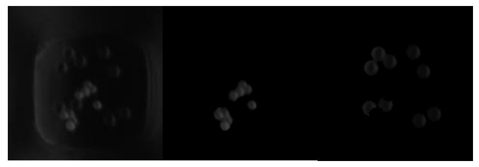

(Left) Image of the fluorescent nanowell with 2.8um and 4.5um beads – background
fluorescence is apparent in this image. (Middle) Image of the same nanowell with only the 2.8um
bead fluorescence; this image is in the NIS28 folder. (Right) Image of the same nanowell with
only the 4.5um bead fluorescence; this image is in the NIS45 folder
For more information, please see the NIS Fluorescence Measurement Section in the User Manual.

# Multiplexed ELISA on a Bead Assays 
### Developed by Jaden Sequeira

Microscopy based multiplexed assays are an important tool for comparing stem cell
derived beta cells and donor beta cells through their secretion profiles. The limited fluorescent
range used by microscopes limits multiplexed assays to the detection of 3 to 4 four biomolecules.
This is because fluorescent labels emit a range of fluorescent wavelengths and overlapping
ranges lead to false detections. The proposed approach to overcome this limitation is to apply a
machine learning model to segment different bead sizes which contain different bioreceptors.
After biomolecules bind to the bioreceptors, they can be fluorescently labeled. The fluorescence
intensity of each biomolecule can then be calculated using the segmented masks of the different
bead sizes. Finally, the mean fluorescence intensities can be converted into concentrations for
each biomolecule using standard curves.

Pancreatic beta cells are pancreatic cells that secrete insulin – an important biomolecule
for body processes such as managing blood glucose levels through cellular glucose uptake. Type
1 Diabetes (T1D) is an autoimmune disease where pancreatic cells are destroyed by the immune
system, thus resulting in less insulin production. Current treatments include lifelong insulin injections,
and more recently, pancreatic beta cell transplants. Donor beta cells are in short supply and thus there is
a critical need for new beta cells sources. Recent research has focussed on the differentiation 
and genetic engineering of pluripotent stem cells into stem cell derived beta cells (SCβ) to be used as a new source for beta cell transplants. 

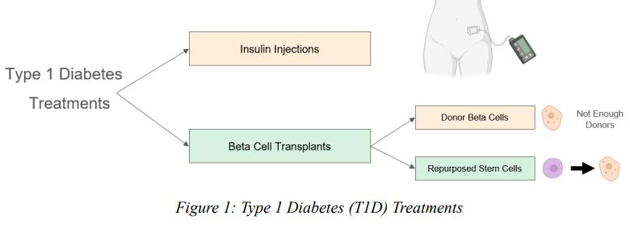

Recently, nanowell technology and fluorescent microscopy was used to investigate
the heterogeneity of glucose stimulated insulin secretion (GSIS) for single pancreatic beta cells.
This study provided insight into the characteristics required of stem cell derived beta cells before
they can be used as a transplant treatment for Type 1 Diabetes. However, there is still a need for
better characterization of donor and SCβ cells regarding their insulin, glucagon, and somatostatin
hormone secretion levels. This will help in understanding if SCβ cells provide the same secretion
standards of donor cells, or if alternative methods such as secretion-based cell
selection if needed.

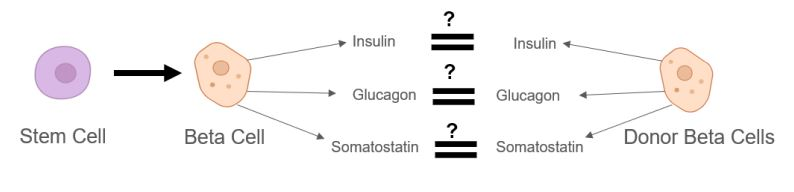

Multiplexed single cell secretion assays can be used to profile donor and stem cell
derived islet cells through their secretion of insulin, glucagon, and somatostatin. This can be
done at the single cell level using nanowells to separate the cells and microscopy to image the
fluorescence of detection beads in each nanowell. These detection beads increase in fluorescence
intensity when the biomolecule of interest increases (e.g. insulin). However, multiplexed single
cell assays that employ microscopy are usually limited to detecting 3-4 different biomolecules. 
This is due to the limited fluorescence emission range and the fact that fluorophores attached to
the beads emit a range of fluorescent wavelengths. Generally, when conducting single cell
assays, two fluorescence stains are used to check if the cell is dead or alive. As a result, there is
not enough space on the fluorescence emission range for an additional three fluorophores for
insulin, glucagon, and somatostatin.

Previous research in increasing the multiplexing capability of microscopy mainly
focussed on decreasing the fluorescence emission ranges of fluorescent labels to minimize
overlap. Instead, it is proposed that different bead sizes can be used to detect different
biomolecules such as insulin, glucagon, and somatostatin, using the same fluorescent label.
Semantic segmentation can be applied to identify and categorize the beads in order to calculate
the fluorescent intensity for each bead size. 
Semantic segmentation is a well-known challenge in the biomedical field. Recently,
researchers have employed deep learning techniques such as U-Net, an encoder-decoder-style
neural network, to segment single cells. The U-Net has a proven ability to segment biomedical
images with good accuracy and minimal training images using image augmentation techniques.

For example, a U-Net was applied to successfully detect rare sperm in microwell
samples from microsurgical testicular sperm extraction. Thus, a U-Net appears to be the best
approach towards segmenting different bead sizes in nanowells. The segmentation
discussed will focus on two different bead sizes and will require the use of three
categories, one for each bead size, and one for the background (including cells). In addition, each
bead size can be used to detect two different biomolecules through the use of two different
fluorophores - resulting in the detection of up to four biomolecules. Table 1 provides an example
of an assay setup for sensing insulin, glucagon, and somatostatin.

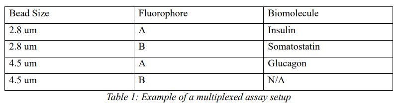

Segmentation is only the first part of the solution towards increasing the multiplexing
capacity of microscopy-based assays through different bead sizes.
The second part requires the application of the segmentation mask to calculate the fluorescent
intensities for each bead size in each nanowell. Fluorescent intensities of each bead size
will be used along with standard curves to determine the concentration of the biomolecules
secreted in each nanowell.

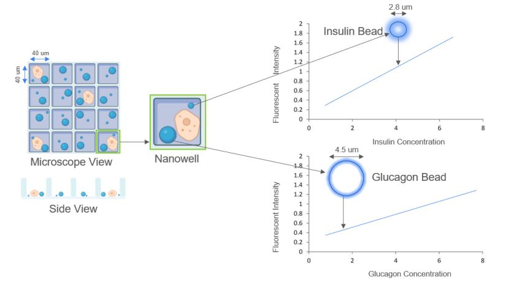

## Software Overview
MultiELISAB folder holds the software for multiplexed bead ELISA measurements.\
Tutorials folder holds links (google drive links) to the 3 video tutorials.\
Documentation folder holds the User Manual and Overview Document.\
Model folder holds an example U-Net Model file that was trained for 2.8um and 4.5um bead segmentation.

## Getting Started
The goal of this software is to segment two different bead sizes from brightfield images of
nanowells and apply this segmentation to the respective fluorescent nanowell images to
determine the fluorescent intensity of each bead size. Ultimately, the software will be used to
measure cell secretion of multiple biomolecules through the fluorescence intensity of nearby
beads in the nanowell. For example, two different sized beads, each with two different
fluorescent emission ranges, can be used to determine the concentrations of up to four different
biomolecules. Please note that the bead sizes are not constrained and can be chosen as long as they are visibly
distinguishable in brightfield nanowell images. However, a new U-Net prediction model
(Training section) will need to be trained for new sizes. This manual will primarily focus on
working with 2.8um and 4.5um beads.
The software is broken into 6 sections and three scripts. The U-Net architecture script is named
Model.py. Excluding the Renaming script, the 5 sections below are all integrated into a user-friendly GUI
in the MultiELISAB.py script. It is recommended to download the PyCharm IDE to
run this code as it makes downloading the required packages quick and simple (hovering over
the imports provides immediate options to download the package). The python interpreter
installed should be 3.10. Additionally, the TensorFlow version downloaded should be 2.15.0. To
manually download required packages, open settings -> Python Interpreter -> + sign (install) and
search the package of interest (e.g. numpy). This process should be used to download the
TensorFlow package due to its specific version requirement.

## Software Functions
### 1. Nanowell Cropping

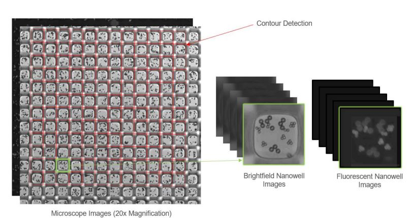
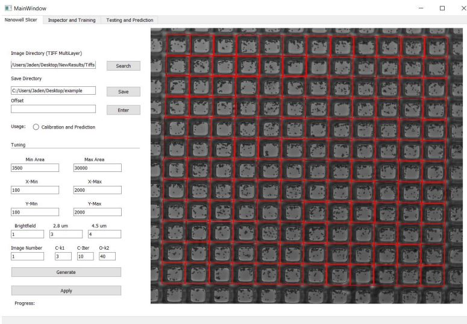

### 2. Quality Inspection of Training Data
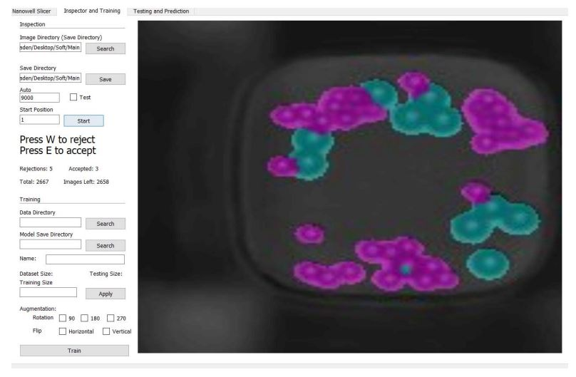
### 3. Training Data Generation
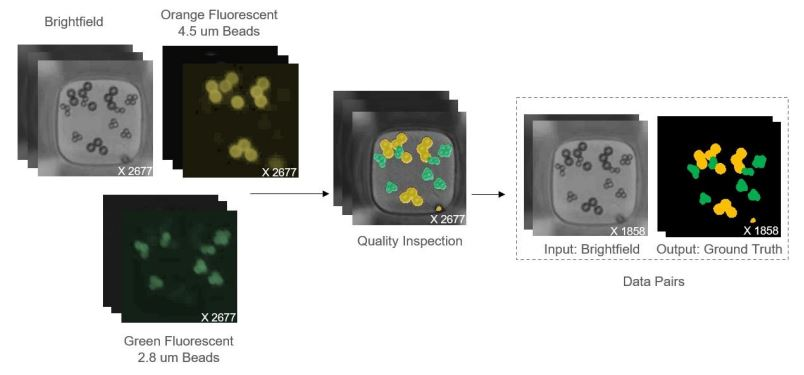
### 4. Image Augmentation (Increasing Training Data)
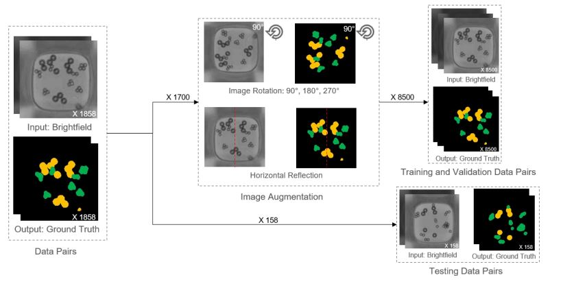
### 5. Segmentation Training
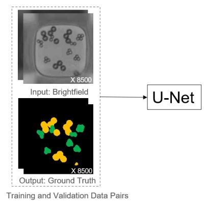
### 6. Segmentation Testing
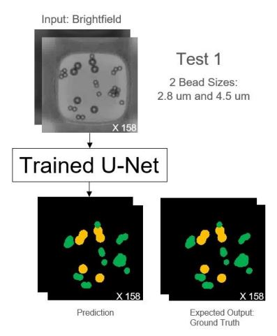
### 7. Segmentation Prediction
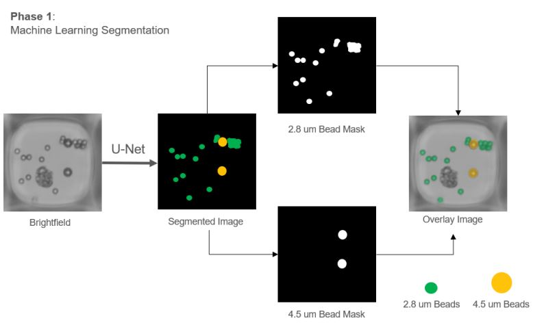
### 8. Standard Curve Generation
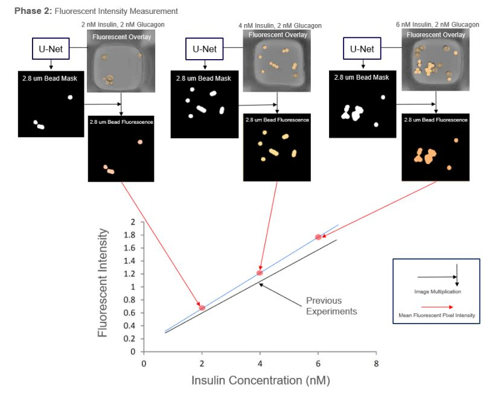
### 9. Re-stitching Segmented Nanowells (Plotting)
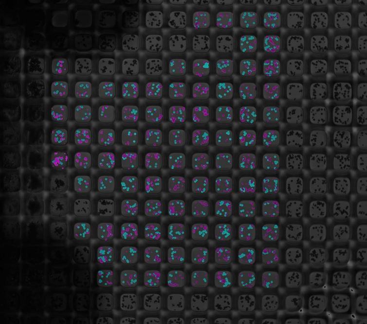

For more information on using each function in the software, please see the user manual located in the Documentation Folder.

## Acknowledgements

I would like to acknowledge and thank the following contributors to the project: Pan Deng for
the design of the Nanowell Cropping algorithm using OpenCV, Deasung Jang for acquiring and
providing experimental data needed to test and develop the software, and Erik Lamoureux for his
help with computing resource setup. I acknowledge and thank Kerryn Matthews, Professor
Hongshen Ma, and the Multi-scale Design Laboratory at UBC for all their supervision, guidance,
and support.

